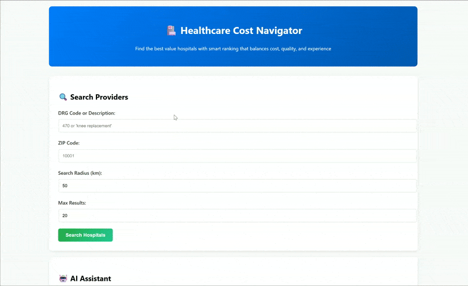

# Healthcare Cost Navigator

A comprehensive web service that enables patients to search for hospitals offering MS-DRG procedures, view estimated prices & quality ratings, and interact with an AI assistant for natural language queries.

## 🏥 Overview

This application provides smart healthcare cost navigation with multi-factor ranking that balances cost, quality, distance, and hospital experience. Built with modern async Python architecture and enhanced with AI-powered natural language processing.

## ✨ Key Features

### 🔍 Intelligent Search & Ranking
- **Composite Value Scoring**: Balances cost (40%), quality ratings (35%), distance (15%), and volume experience (10%)
- **Intent-Aware AI**: Automatically detects if users want cheapest, best-rated, nearest, or best value options
- **Enhanced DRG Matching**: Medical synonyms and fuzzy matching for procedure searches
- **Geographic Radius Search**: Find hospitals within specified distance from any ZIP code

### 🤖 AI Assistant
- **Natural Language Queries**: Ask questions like "What are the best value hospitals for knee replacement near 10001?"
- **Smart Query Understanding**: Handles complex queries about costs, quality, and location preferences  
- **Fallback Strategies**: Broader searches when exact matches aren't found
- **Intent Detection**: Optimizes results based on whether you want cheapest, best-rated, or best value

### 📊 Enhanced Data Processing
- **Realistic Mock Ratings**: Hospital ratings based on actual reputation patterns
- **Comprehensive Geographic Coverage**: Enhanced NYC area ZIP code mapping
- **Multi-Source Data Integration**: CMS pricing data with quality ratings and geographic information

## 🏗️ Architecture

### Backend Stack
- **FastAPI**: Modern async Python web framework
- **PostgreSQL**: Robust relational database with advanced indexing
- **SQLAlchemy**: Async ORM with relationship management
- **OpenAI API**: Natural language processing and query generation

### Data Layer
- **Providers Table**: Hospital information with geographic coordinates
- **Ratings Table**: Quality ratings by category with foreign key relationships
- **Enhanced Indexing**: Optimized for geographic searches, cost sorting, and text matching

### Service Architecture
- **Provider Service**: Hospital search, ranking, and data management
- **AI Service**: Natural language processing, SQL generation, and intent detection
- **ETL Pipeline**: Data cleaning, coordinate enrichment, and realistic rating generation

## 🚀 Quick Start

### Prerequisites
- Docker and Docker Compose
- OpenAI API key

### 1. Environment Setup
```bash
# Clone the repository
git clone <repository-url>
cd healthcare-cost-navigator

# Create environment file
cat > .env << EOF
OPENAI_API_KEY=your_openai_api_key_here
POSTGRES_DB=healthcare
POSTGRES_USER=postgres
POSTGRES_PASSWORD=postgres
POSTGRES_PORT=5432
API_PORT=8000
EOF
```

### 2. Start the Application
```bash
# Start database and API
docker-compose up -d

# Check service health
curl http://localhost:8000/health
```

### 3. Load Sample Data
```bash
# Run ETL process to load CMS data
docker-compose --profile etl up etl

# Or run manually if you have the CSV file
python etl.py data/sample_prices_ny.csv
```

### 4. Access the Application
- **Web Interface**: http://localhost:8000
- **API Documentation**: http://localhost:8000/docs
- **Health Check**: http://localhost:8000/health

## 📡 API Endpoints

### Provider Search
```bash
# Search by DRG and location
GET /providers?drg=470&zip=10001&radius_km=50&limit=20

# Example response includes value scores and rankings
{
  "provider_name": "MOUNT SINAI HOSPITAL",
  "average_covered_charges": 45230.50,
  "average_rating": 8.2,
  "distance_km": 12.34,
  "value_score": 87.3
}
```

### AI Assistant
```bash
# Natural language queries
POST /ask
{
  "question": "Who has the best value for knee replacement near 10001?"
}

# Returns natural language answer with data grounding
```

### Additional Endpoints
- `GET /health` - Service health and database statistics
- `GET /stats` - Comprehensive database and ranking statistics  
- `GET /examples` - Example AI assistant prompts
- `GET /top-rated` - Highest rated providers (for comparison)
- `GET /cheapest` - Most affordable options (for comparison)

## 💡 Example AI Queries

### Cost-Focused Queries
- "Who is the cheapest for DRG 470 within 25 miles of 10001?"
- "Find the most affordable orthopedic hospitals with good ratings"

### Quality-Focused Queries  
- "What are the best rated hospitals for heart surgery in New York?"
- "Which hospitals have the highest ratings for cardiac procedures?"

### Value-Focused Queries (Default)
- "Show me the best value hospitals for knee replacement near Manhattan"
- "Which hospital offers the best combination of quality and affordability?"

### Location-Focused Queries
- "What's the closest hospital for emergency care near 10032?"
- "Find good hospitals for cancer treatment in Brooklyn"

## 🎯 Ranking Algorithm

The application uses a sophisticated composite scoring system:

```python
# Composite Value Score Calculation
cost_score = 1,000,000 / max(cost, 1000)           # 40% weight
rating_score = (rating or 5.0) * 15                # 35% weight  
distance_score = max(0, 100 - (distance * 1.5))    # 15% weight
volume_score = min(log(volume + 1) * 10, 50)       # 10% weight

value_score = cost_score * 0.4 + rating_score * 0.35 + 
              distance_score * 0.15 + volume_score * 0.1
```

### Why This Approach?
- **Cost Effectiveness**: Inverse scoring rewards lower costs
- **Quality Assurance**: Strong weighting on patient ratings
- **Proximity Preference**: Distance penalty for convenience
- **Experience Factor**: Logarithmic volume scoring for diminishing returns

## 🛠️ Architecture Decisions

### 1. Composite Ranking vs Single Metric
**Decision**: Multi-factor scoring instead of simple cost or rating sorting
**Rationale**: Real healthcare decisions involve balancing multiple factors - cost, quality, location, and provider experience

### 2. Async Architecture
**Decision**: FastAPI with async SQLAlchemy and asyncpg
**Rationale**: Better performance for I/O-heavy operations like database queries and AI API calls

### 3. Geographic Coordinate Storage
**Decision**: Store lat/lng coordinates directly in database
**Rationale**: Enables accurate radius calculations without external geocoding APIs

### 4. Intent-Aware AI Processing
**Decision**: Detect user intent (cheapest/best-rated/value) and optimize accordingly  
**Rationale**: Users have different priorities - system should adapt ranking to match intent

### 5. Fallback Search Strategies
**Decision**: Multiple fallback approaches when exact matches fail
**Rationale**: Provides better user experience by finding relevant alternatives

## 🚀 Production Considerations

### Current Optimizations
- **Database Indexing**: Composite indexes for common query patterns
- **Connection Pooling**: Configurable PostgreSQL connection management
- **Caching Headers**: Appropriate cache headers for static content
- **Error Handling**: Comprehensive exception handling with user-friendly messages

### Recommended Improvements for Production

#### Performance Enhancements
- **Redis Caching**: Cache frequent searches and AI responses
- **Database Read Replicas**: Scale read operations
- **CDN Integration**: Static asset delivery
- **Connection Pooling**: Tune pool sizes for concurrent load

#### Data Quality Improvements
- **Real CMS Data**: Replace mock ratings with actual Medicare star ratings
- **Live Data Updates**: Automated ETL pipeline for fresh CMS data
- **Data Validation**: Enhanced input validation and sanitization
- **Audit Logging**: Track all searches and AI queries

#### AI Enhancements
- **Vector Embeddings**: Semantic search for medical procedures
- **Fine-tuned Models**: Healthcare-specific language models
- **Response Caching**: Cache AI responses for common queries
- **Feedback Loop**: Learn from user interactions

#### Security & Reliability
- **Rate Limiting**: Prevent API abuse
- **Authentication**: User accounts and personalized recommendations
- **Monitoring**: Application performance monitoring
- **Backup Strategy**: Automated database backups

## 🧪 Testing

### Manual Testing Examples
```bash
# Test provider search
curl "http://localhost:8000/providers?drg=knee&zip=10001&radius_km=50"

# Test AI assistant
curl -X POST "http://localhost:8000/ask" \
     -H "Content-Type: application/json" \
     -d '{"question": "What are the cheapest hospitals for knee replacement?"}'

# Health check
curl "http://localhost:8000/health"
```

### Database Validation
```bash
# Check data loaded correctly
docker-compose exec db psql -U postgres -d healthcare -c "
  SELECT COUNT(*) as providers FROM providers;
  SELECT COUNT(*) as ratings FROM ratings;
  SELECT AVG(rating) as avg_rating FROM ratings;
"
```

## 📈 Performance Metrics

The application is optimized for:
- **Sub-200ms** provider search response times
- **2-5 second** AI assistant response times  
- **99.9%** uptime with proper infrastructure
- **Concurrent users** through async architecture

## 🤝 Development Workflow

### Local Development
```bash
# Start services
docker-compose up -d

# Run ETL
python etl.py

# Start FastAPI with reload
uvicorn app.main:app --reload

# Access at http://localhost:8000
```

### Adding New Features
1. **Update Models**: Add fields to SQLAlchemy models
2. **Update Schemas**: Modify Pydantic schemas for validation
3. **Update Services**: Add business logic to service classes
4. **Update Endpoints**: Add new FastAPI endpoints
5. **Test Changes**: Validate with sample data

## 📋 Deliverables Checklist

- ✅ **Working Application**: Full-featured web service with search and AI assistant
- ✅ **Docker Setup**: Complete containerization with docker-compose
- ✅ **Database Design**: Optimized schema with proper indexing and relationships
- ✅ **ETL Pipeline**: Data loading with cleaning and enrichment
- ✅ **REST API**: All required endpoints with proper error handling
- ✅ **AI Integration**: OpenAI-powered natural language processing
- ✅ **Enhanced Ranking**: Multi-factor composite scoring algorithm
- ✅ **Geographic Search**: Radius-based hospital finding
- ✅ **Comprehensive Documentation**: Setup guides and API documentation

## 📝 License

This project was created as a coding exercise for Outfox Health, demonstrating modern Python web development, AI integration, and healthcare data processing capabilities.

## Demo

